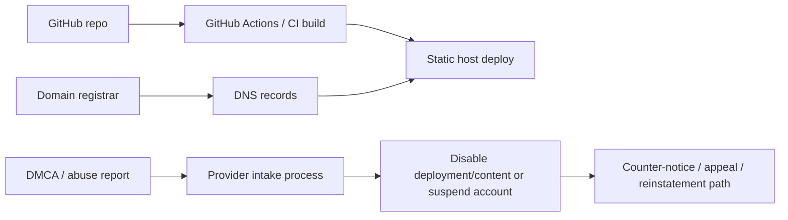

# Legal and policy comparison for static front-end hosting options for Musifer

## Scope and methodology

Musifer is described as a regional U.S., all-ages, public-facing music-and-creative-services site running a static/JAMstack architecture with GitHub-centered CI/CD (GitHub repo + GitHub Actions or comparable workflow). This review compares static/front-end hosting providers (not registrars) on operator risk—especially around copyright/DMCA, abuse handling, privacy posture, and suspension/termination discretion—based on each provider’s currently published official documentation as of March 13, 2026. citeturn4view4turn9view0turn6view4turn13view0turn4view6turn5view4

Primary sources are the providers’ governing legal documents (Terms, AUP, Privacy, DMCA/IP policies) supplemented by official operational/trust docs where those clarify real-world abuse intake, takedown mechanics, and platform control boundaries. Where a provider’s documentation explicitly incorporates additional terms or “service-specific” terms by reference, those are treated as part of the binding document stack. citeturn6view4turn6view3turn11view5turn4view6turn5view4

This is not legal advice; it is a comparative policy/document review intended to help you choose a host that reduces operator ambiguity for a copyright-heavy but legitimate, all-ages portfolio/promotion site. Background DMCA context is grounded in the U.S. Copyright Office’s overview of §512 safe harbors (notice-and-takedown and related conditions). citeturn0search37turn9view0

Mermaid overview of the control/decision points that policies map onto (host vs deployment vs DNS/custom domain):

## Executive summary

- **Most operator-friendly overall (policy clarity + practical workflows): Render Static Site and Vercel**. Both publish detailed DMCA procedures (including counter-notice mechanics and repeat-infringer language) and support Git-based preview deployments, which helps you keep GitHub-centered CI while gaining operational tooling beyond GitHub Pages. citeturn17view1turn17view3turn13view3turn11view0turn5view2  
- **Best “baseline simplicity,” but with policy constraints: GitHub Pages**. It is tightly integrated with GitHub and has clear usage limits, but it explicitly states it is not intended/allowed as free hosting for an online business/e-commerce or a site primarily directed at commercial transactions or commercial SaaS, and it has soft bandwidth/build limits. That can become a friction point as Musifer becomes more commercial or higher-bandwidth (music media). citeturn4view4turn4view5  
- **Cloudflare Pages is strong for GitHub workflow and preview controls, but has a Musifer-specific media risk**: Cloudflare’s service-specific CDN terms warn they may limit/disable CDN access if you serve a disproportionate percentage of audio (or other large files) without using certain paid services. A music site that self-hosts many audio files could trip this more easily than a typical marketing site. citeturn6view0turn6view1turn6view3  
- **Highest “contract discretion” signals to watch: Cloudflare and Vercel**. Cloudflare’s self-serve agreement includes broad “with or without notice / for any reason” termination language and mentions suspension/termination upon “any number” of DMCA notifications or repeat infringement; Vercel reserves broad rights to remove/disable content and (on the Hobby plan especially) terminate deployments with minimal notice. citeturn16view0turn15view3turn19view2  
- **Most procedural DMCA “operator predictability”: Render**. Render’s DMCA policy describes a default timeline (commonly giving 2 business days to remediate before disabling) and states a 10–14 business day restoration window after a valid counter-notice unless the complainant files suit—helpful for setting internal response playbooks. citeturn17view1turn17view3  
- **Most “platform boundary clarity” for DMCA: GitHub and Vercel**. GitHub notes it cannot disable specific files inside a repo and therefore uses a notice → short remediation window → disable flow; Vercel’s DMCA policy explains it generally acts at the “deployment” level and may disable whole deployments (and sometimes specific pages) rather than arbitrarily removing individual assets. citeturn9view0turn4view2  
- **Firebase Hosting is viable for GitHub-centered deploys but has a multi-layer legal stack and less product-specific DMCA narrative**. Official docs emphasize GitHub Actions-based preview channels and Google’s legal reporting pathways; you should expect copyright/legal complaints to flow through Google’s legal tools rather than a hosting-specific DMCA policy page like Render/Vercel provide. citeturn5view7turn11view8turn11view7turn11view9  
- **Netlify remained intentionally suppressed for this research round.** “Netlify-like” gaps (preview deploys, access-gated previews) are addressable within the reviewed set; if you later need CMS-auth identity workflows, reintroducing Netlify can be limited to that narrow question set. citeturn6view1turn11view0turn5view2  

## Comparison matrix

Risk rating here is **operator risk for Musifer** (policy ambiguity + likelihood of disruption under normal, legitimate music/portfolio use), not “security quality.”

| Option | Role | Key governing docs reviewed | GitHub workflow fit | Copyright/DMCA posture | Abuse handling posture | Privacy/data posture | Suspension/termination discretion | Notable unusual clauses | Practical fit for Musifer | Overall risk |
|---|---|---|---|---|---|---|---|---|---|---|
| GitHub Pages | Static host (constrained) | Pages limits `https://docs.github.com/en/pages/getting-started-with-github-pages/github-pages-limits`; Additional Products & Features (Pages) `https://docs.github.com/en/site-policy/github-terms/github-terms-for-additional-products-and-features`; GitHub ToS `https://docs.github.com/en/site-policy/github-terms/github-terms-of-service`; AUP `https://docs.github.com/en/site-policy/acceptable-use-policies/github-acceptable-use-policies`; DMCA policy `https://docs.github.com/en/site-policy/content-removal-policies/dmca-takedown-policy`; Privacy `https://docs.github.com/en/site-policy/privacy-policies/github-general-privacy-statement` citeturn4view4turn4view5turn12view0turn9view2turn9view0turn9view3 | **Excellent** (native) | Clear DMCA flow; user gets ~1 business day to remediate in many cases; counter-notice restores in 10–14 days unless suit citeturn9view0 | Enforcement via ToS/AUP + documented content-removal policies citeturn9view2turn9view1 | Privacy statement + controls; age gating for accounts (13+) citeturn9view3turn9view1 | GitHub may terminate with or without cause/notice; Pages has quotas citeturn12view1turn4view4 | Pages not intended/allowed as free hosting for “online business/e-commerce / primarily commercial transactions or commercial SaaS” citeturn4view4turn4view5 | Best if Musifer stays “showcase/portfolio” and avoids being transaction-centered; bandwidth limits are real for media citeturn4view4turn4view5 | Moderate |
| Cloudflare Pages | Static front-end host + CDN network | Self-Serve Subscription Agreement `https://www.cloudflare.com/terms/`; Service-Specific Terms (Application Services/CDN) `https://www.cloudflare.com/service-specific-terms-application-services/`; Privacy `https://www.cloudflare.com/privacypolicy/`; Trust Hub “Abuse approach” `https://www.cloudflare.com/trust-hub/abuse-approach/`; Trust Hub “Reporting abuse” `https://www.cloudflare.com/trust-hub/reporting-abuse/`; Complaint types `https://developers.cloudflare.com/fundamentals/reference/report-abuse/complaint-types/`; Pages GitHub integration `https://developers.cloudflare.com/pages/configuration/git-integration/github-integration/`; Preview deploys `https://developers.cloudflare.com/pages/configuration/preview-deployments/` citeturn6view4turn6view3turn6view5turn6view6turn6view7turn6view9turn6view0turn6view1 | **Strong** native GitHub app; preview URLs; cannot connect self-hosted GitHub/GitLab instances directly citeturn6view0turn6view2 | Trust Hub describes DMCA notice-and-takedown with counter-notice restoration for hosted content citeturn6view6turn6view7 | Strong centralized abuse form intake; email generally not used for most complaints citeturn6view7turn6view9 | Privacy policy states no sale/rent of personal info; service can add cookies/scripts depending on features citeturn6view5turn16view7 | Broad termination: “with or without notice / any reason,” plus “any number of DMCA notifications” language citeturn16view0turn16view2 | CDN service terms explicitly call out disproportionate audio/large-file serving risk without paid services citeturn6view3 | Great for typical static + embedded media; **riskier if Musifer self-hosts lots of audio** through the CDN/Pages path citeturn6view3turn6view6 | Elevated (for audio-heavy); otherwise Moderate |
| Vercel | Frontend platform + deploy system + edge | ToS `https://vercel.com/legal/terms`; AUP `https://vercel.com/legal/acceptable-use-policy`; Privacy `https://vercel.com/legal/privacy-policy`; DMCA policy `https://vercel.com/legal/dmca-policy`; Trademark policy `https://vercel.com/legal/trademark-policy`; DPA `https://vercel.com/legal/dpa`; GitHub integration docs `https://vercel.com/docs/git/vercel-for-github` citeturn13view0turn13view5turn13view7turn13view3turn11view2turn11view3turn11view0 | **Strong** native GitHub integration; preview deployment URLs; custom domain updates; deploy-per-push defaults citeturn11view0turn11view1 | DMCA policy describes disablement at deployment/page level; counter-notice restores in 10–14 business days unless suit; repeat infringer termination at discretion citeturn4view2turn14view0turn13view3 | Abuse is routed through a dedicated abuse form; AUP ties violations to suspension/termination citeturn11view5turn13view5 | Privacy says services not directed to under-16; DPA provides processor/controller split and subprocessor list path citeturn15view0turn11view3 | ToS: can remove/disable content for any/no reason; ToS includes arbitration; termination rights include immediate termination if exceeding limits citeturn19view2turn14view2turn15view5 | AUP bans “host media for hot-linking”; broad license-back to content (sublicensable/transferable) citeturn15view1turn19view2 | Very good if Musifer wants previews, custom domains, and a clear DMCA process; watch media-hotlinking language if you plan “asset CDN” behavior citeturn15view1turn4view2 | Moderate |
| Render Static Site | Static host + global CDN | ToS `https://render.com/terms`; AUP `https://render.com/acceptable-use`; Privacy `https://render.com/privacy`; DMCA policy `https://render.com/dmca-policy`; DPA `https://render.com/dpa`; Static Sites docs `https://render.com/docs/static-sites`; Preview env docs `https://render.com/docs/preview-environments` (platform-wide) citeturn4view6turn4view7turn5view0turn5view1turn7search3turn5view2turn5view3 | **Strong** Git repo linking; PR previews are supported for static sites; custom domains supported citeturn5view2turn5view3 | DMCA policy: notifies user and typically gives 2 business days; counter-notice restore 10–14 business days; repeat infringer policy described citeturn17view1turn17view3turn17view4 | AUP: enforcement at “sole discretion,” including takedown of content or account suspension; abuse reporting via abuse@render.com citeturn4view7 | Privacy policy; ToS restricts users under 16 from using the service; DPA exists citeturn5view0turn4view6turn7search3 | ToS includes arbitration/class waiver; AUP/ToS allow removal and suspension; liability cap ($100 or fees paid) citeturn17view5turn4view6 | **Unusually explicit DMCA timeline** (2 business days) which improves predictability; AUP “sole discretion” is strict but common citeturn17view1turn4view7 | Strong all-around option for Musifer if you want a simple solo-dev host with a clear DMCA playbook citeturn17view1turn5view2 | Low to Moderate |
| Firebase Hosting | Static/web hosting on Google CDN; integrates with broader Firebase/Google Cloud | Firebase terms index `https://firebase.google.com/terms`; Firebase Data Processing & Security Terms `https://firebase.google.com/terms/data-processing-terms`; Google Cloud AUP `https://cloud.google.com/terms/aup`; Hosting SLA `https://firebase.google.com/terms/service-level-agreement`; Privacy & Security in Firebase `https://firebase.google.com/support/privacy`; GitHub integration `https://firebase.google.com/docs/hosting/github-integration`; Google legal reporting `https://support.google.com/legal/troubleshooter/1114905?hl=en`; Google Cloud abuse form points to legal tool citeturn18view4turn5view6turn5view5turn11view10turn11view6turn5view7turn11view7turn11view8 | **Good** via GitHub Actions; official PR preview channels/workflows exist citeturn5view7 | Google states it responds to compliant copyright notices in at least some Google Cloud contexts; reporting is routed through Google legal tools rather than a hosting-specific DMCA page citeturn11view9turn11view7turn11view8 | Abuse/copyright reporting more centralized (legal troubleshooter); AUP prohibits infringing/unlawful uses citeturn11view7turn5view5 | Firebase collects “Firebase Service Data”; usage may be used per Google privacy policy; data-processing terms define order of precedence and change controls citeturn11view6turn5view6 | Suspension/termination details largely live in incorporated Google Cloud terms; AUP is explicit about prohibited activity categories citeturn5view5turn18view4 | Firebase terms index includes a “business use” acknowledgement (trade/business/craft/profession) which is a different posture than “hobby hosting” citeturn18view4 | Viable if Musifer may later want integrated services; higher “stack complexity” and more indirect takedown/appeal narrative than Render/Vercel citeturn5view7turn11view7 | Moderate |

## Provider-by-provider findings

### GitHub Pages

GitHub Pages is the “baseline” static host aligned with your current production context. Its strongest advantage is workflow simplicity (everything stays inside GitHub), but its policies repeatedly frame Pages as a static “showcase” feature rather than a general-purpose commercial hosting product. citeturn4view5turn4view4

**Documents reviewed (official)**
- GitHub Pages limits — `https://docs.github.com/en/pages/getting-started-with-github-pages/github-pages-limits` (last updated: unspecified). citeturn4view4  
- GitHub Terms for Additional Products and Features (Pages section) — `https://docs.github.com/en/site-policy/github-terms/github-terms-for-additional-products-and-features` (Version Effective Date: April 1, 2025). citeturn12view5turn4view5  
- GitHub Terms of Service — `https://docs.github.com/en/site-policy/github-terms/github-terms-of-service` (Effective date: November 16, 2020). citeturn12view0turn9view1  
- GitHub Acceptable Use Policies — `https://docs.github.com/en/site-policy/acceptable-use-policies/github-acceptable-use-policies` (last updated: unspecified). citeturn9view2  
- GitHub DMCA Takedown Policy — `https://docs.github.com/en/site-policy/content-removal-policies/dmca-takedown-policy` (last updated: unspecified). citeturn9view0  
- GitHub General Privacy Statement — `https://docs.github.com/en/site-policy/privacy-policies/github-general-privacy-statement` (Effective date: February 1, 2024). citeturn9view3  

**Most relevant policy points for Musifer**
- GitHub Pages states it is not intended/allowed to be used as free hosting to run an online business/e-commerce site or any site primarily directed at facilitating commercial transactions or providing commercial SaaS. For Musifer, this is the core “policy mismatch” risk if you plan to sell services directly on-site (payments, storefront, ticketing, etc.). citeturn4view4turn4view5  
- Pages has explicit usage limits that can matter for music/media: published site size ≤ 1 GB, soft bandwidth limit 100 GB/month, and soft build limits (with notes about GitHub Actions potentially changing how build limits apply). For a music site serving media files directly, the bandwidth limit is a practical risk. citeturn4view4  
- GitHub’s DMCA approach is unusually transparent and procedurally detailed: if a notice targets only part of a repo, GitHub typically gives the user ~1 business day to remove/modify the identified content; counter-notice restores in 10–14 days unless the complainant files suit. This matters because it creates a predictable “response clock” for Musifer’s own internal takedown handling. citeturn9view0  
- GitHub emphasizes it cannot disable access to specific files inside a repo, which drives their “edit quickly or repo disabled” approach. For Musifer, this means a single alleged infringing file could put the whole Pages source repo at risk if not remediated promptly. citeturn9view0  
- GitHub ToS grants GitHub broad rights to remove user-generated content at its sole discretion and to terminate access with or without cause/notice. In practice, GitHub also publishes process docs, but the contract baseline is highly discretionary. citeturn12view1turn9view1  
- The Pages documentation itself frames “putting a third-party CDN in front” or “moving to a different hosting service” as potential responses if you exceed quotas—implicitly acknowledging that some legitimate uses (often high-bandwidth) are a poor fit for Pages. citeturn4view4  

**Boilerplate vs unusual assessment**
- Not intended for online business / primarily commercial transactions: **stricter than average** among “static hosts,” and unusually explicit for a feature-positioned host. citeturn4view4turn4view5  
- Tight bandwidth/site size limits: **stricter than average** for modern static platforms, and directly relevant to hosting music media. citeturn4view4  
- DMCA/counter-notice flow: generally **clearer than average** (procedural clarity is unusually high). citeturn9view0  

### Cloudflare Pages

Cloudflare Pages gives you modern static hosting with first-class GitHub integration, preview deployments, and optional access controls for previews. However, Cloudflare’s CDN-oriented service-specific terms contain a Musifer-specific hazard: disproportionate audio/large-file serving can trigger access limitation unless you’re using certain paid services. citeturn6view0turn6view3turn6view1

**Documents reviewed (official)**
- Cloudflare Self-Serve Subscription Agreement — `https://www.cloudflare.com/terms/` (Last updated: September 12, 2025). citeturn6view4  
- Cloudflare Service-Specific Terms (Application Services; includes CDN clause) — `https://www.cloudflare.com/service-specific-terms-application-services/` (last updated context: Aug 11, 2025 shown in search; clause reviewed directly). citeturn6view3  
- Cloudflare Privacy Policy — `https://www.cloudflare.com/privacypolicy/` (Effective: November 4, 2025). citeturn6view5  
- Trust Hub “Abuse approach” — `https://www.cloudflare.com/trust-hub/abuse-approach/` (date not presented in the excerpted section). citeturn6view6  
- Trust Hub “Reporting abuse” — `https://www.cloudflare.com/trust-hub/reporting-abuse/` (date not presented in the excerpted section). citeturn6view7  
- Complaint types (Cloudflare Fundamentals docs) — `https://developers.cloudflare.com/fundamentals/reference/report-abuse/complaint-types/` (Last updated: Aug 13, 2024). citeturn6view9turn3search32  
- Pages GitHub integration — `https://developers.cloudflare.com/pages/configuration/git-integration/github-integration/` (Last updated: Feb 23, 2026). citeturn2search0turn6view0  
- Pages preview deployments — `https://developers.cloudflare.com/pages/configuration/preview-deployments/` (date not shown in excerpt; content reviewed). citeturn6view1  

**Most relevant policy points for Musifer**
- GitHub workflow fit is strong: preview URLs for PRs (non-fork PRs), branch controls, and “manage/preview deployments directly in GitHub” are explicitly documented. This helps keep GitHub as CI/CD while getting “modern platform” features. citeturn6view0turn6view2turn6view1  
- Preview deployments are public by default; Cloudflare documents how to restrict preview deployment viewing via Cloudflare Access policies (protecting previews only, unless you address known issues for broader coverage). This matters if Musifer’s repo includes licensed-but-not-public preview assets. citeturn6view1  
- Trust Hub abuse approach explicitly treats Cloudflare Pages as a case where Cloudflare can qualify as the origin hosting provider and will remove/disable hosted content that violates terms; for copyright/trademark, it follows DMCA notice-and-takedown with counter-notice restoration if the reporter doesn’t sue. This provides a “host-level” enforcement posture, not merely “we’re a proxy.” citeturn6view6  
- **Key Musifer red flag:** Cloudflare’s CDN service-specific terms state that unless you are an Enterprise customer, you must use specific paid services to serve “video and other large files” via the CDN, and Cloudflare reserves the right to disable/limit CDN access if you serve “a disproportionate percentage of pictures, audio files, or other large files” without those paid services. If Musifer plans to self-host lots of MP3/FLAC previews or downloadable audio, this is unusually on-point and could drive unexpected enforcement. citeturn6view3  
- Cloudflare’s Self-Serve Subscription Agreement contains very broad suspension/termination language (“with or without notice; any reason or no reason”) and specifically mentions termination/suspension upon receiving any number of DMCA notifications or learning you are a repeat infringer. For Musifer, even non-merit DMCA spam could become an operational risk if it accumulates. citeturn16view0  
- Cloudflare’s abuse reporting intake is strongly standardized around an online form; Trust Hub states Cloudflare is generally unable to process complaints submitted by email (with a narrow registrar exception). This matters for “abuse pathway predictability” (good) but also means you should expect the same form-based workflow if you ever need fast escalation. citeturn6view7  

**Boilerplate vs unusual assessment**
- CDN “disproportionate audio” limitation: **stricter than average and unusually specific** (audio is named). citeturn6view3  
- “Any number of DMCA notifications” as a termination trigger: **unusually unfavorable** (many providers say “repeat infringer,” fewer say “any number”). citeturn16view0  
- Preview deployments public-by-default: **common**, but Cloudflare’s Access integration is an **unusually strong mitigation** within the same ecosystem. citeturn6view1  

### Vercel

Vercel is a front-end platform with deeply integrated Git-based deployments, preview URLs, and custom domain automation. Its policy posture is broadly similar to other SaaS hosts (license-back to content, discretionary enforcement), but it provides clearer DMCA mechanics than many competitors and explicitly describes the technical boundaries of what it can disable. citeturn11view0turn4view2turn19view2

**Documents reviewed (official)**
- Terms of Service — `https://vercel.com/legal/terms` (Last updated: August 20, 2025). citeturn13view0turn19view2  
- Acceptable Use Policy — `https://vercel.com/legal/acceptable-use-policy` (Last updated: August 19, 2025). citeturn13view5turn15view1  
- Privacy Policy — `https://vercel.com/legal/privacy-policy` (Last updated: April 22, 2024). citeturn13view7turn15view0  
- DMCA Policy — `https://vercel.com/legal/dmca-policy` (Last updated: February 26, 2024). citeturn13view3turn14view0turn4view2  
- Trademark Policy — `https://vercel.com/legal/trademark-policy` (Last updated: February 27, 2024). citeturn11view2  
- Data Processing Agreement — `https://vercel.com/legal/dpa` (Last updated: March 31, 2023). citeturn11view3  
- GitHub deployment docs (workflow) — `https://vercel.com/docs/git/vercel-for-github` (Last updated: December 5, 2025). citeturn11view0  

**Most relevant policy points for Musifer**
- Vercel for GitHub provides preview deployment URLs and “deploy per push” defaults, plus automatic custom domain updates. This supports a GitHub-centered pipeline while expanding beyond GitHub Pages’ constraints. citeturn11view0turn11view1  
- Vercel’s ToS license-back: by posting content, you grant a worldwide, royalty-free, sublicensable/transferable license to use/modify/distribute/display/store your content as necessary to provide the services and for security protection (fraud/malware/etc.). For Musifer, this is fairly standard SaaS language but should be acknowledged because it is broad and transferable. citeturn19view2turn19view0  
- Vercel reserves the right to remove or disable content “at any time for any reason or no reason,” with an EEA-specific complaint/review language. For Musifer, that means “legitimate but disputed” IP conflict can still become a hosting interruption risk. citeturn19view2  
- DMCA policy explains technical scope in unusually concrete terms: Vercel doesn’t monitor/police deployments; if infringement is alleged across an entire site it disables the deployment; if only portions are alleged, it may disable specific pages—but it also emphasizes it can only address deployments made through the platform. This matters for Musifer because it affects how surgically you can remediate a complaint (and how quickly). citeturn4view2  
- Vercel’s DMCA policy includes a counter-notice restoration window of 10–14 business days unless the complainant files suit, and it states a repeat infringer termination policy “in its sole discretion.” citeturn4view2turn14view0  
- Vercel’s AUP includes a clause that can surprise media-heavy sites: “host media for hot-linking” is disallowed. For Musifer, the interpretation hinges on whether you are effectively providing an asset CDN for third parties (hotlinking) versus hosting your own first-party media for your own pages; the language is vague enough that it’s worth treating as a caution flag if you plan to distribute large downloadable media. citeturn15view1  
- Age posture: Vercel’s Privacy Policy states the services are not directed or intended for individuals under 16 and it doesn’t knowingly collect data from under-16s. This is about the user/account relationship more than Musifer’s site visitors, but it’s a signal of a “not for kids” stance in provider policy even when your public site audience includes minors. citeturn15view0  

**Boilerplate vs unusual assessment**
- License-back for hosting/security: **standard boilerplate** for SaaS hosting, though still broad. citeturn19view2  
- “Remove/disable for any reason”: **common but operator-unfriendly** (vague). citeturn19view2  
- “Host media for hot-linking” AUP clause: **vaguer than average** and potentially relevant to a music/media operator. citeturn15view1  
- DMCA explanation of deployment-level limits: **clearer than average**. citeturn4view2  

### Render Static Site

Render’s static site offering is positioned as a global-CDN static host with Git repo linking, custom domains, and pull request previews. Legally, it behaves like other SaaS providers (AUP/ToS discretion, arbitration, indemnities), but its DMCA documentation is unusually explicit and timeline-based. citeturn5view2turn4view6turn17view1

**Documents reviewed (official)**
- Terms of Service — `https://render.com/terms` (Last modified: April 25, 2025). citeturn4view6  
- Acceptable Use Policy — `https://render.com/acceptable-use` (Last modified: August 22, 2025). citeturn4view7  
- Privacy Policy — `https://render.com/privacy` (Last modified: October 29, 2025). citeturn5view0  
- DMCA Policy — `https://render.com/dmca-policy` (Last modified: December 3, 2025). citeturn5view1turn17view1  
- Data Processing Addendum — `https://render.com/dpa` (Last modified: December 19, 2024). citeturn7search3  
- Static Sites docs — `https://render.com/docs/static-sites` (date not shown in excerpt; content reviewed). citeturn5view2  

**Most relevant policy points for Musifer**
- Render static sites are served over a “global CDN,” support custom domains, and support pull request previews. Operationally, this matches the “GitHub-centered but not GitHub-hosted” preference. citeturn5view2  
- Render ToS prohibits use by anyone under 16 and includes arbitration/class waiver language. As with Vercel, this is about your operator account relationship, but it signals a general “not for under-16 users” stance at the platform-account layer. citeturn4view6turn17view5  
- Render AUP states that violations are determined in Render’s “sole discretion,” and enforcement may include warnings, takedown of user content, or suspension/termination; it also includes an “unreasonable or disproportionately large load” concept. For Musifer, that interacts with hosting large media files (bandwidth spikes) and is a standard but important “don’t become a file host” constraint. citeturn4view7  
- Render’s DMCA policy includes an explicit (and unusually legible) timeline: Day 0 notice + verification; Day 0 notify user; “2 business days” to respond/remove; by Day 2 they may disable access to the identified material/service. That predictability is directly useful for Musifer’s internal takedown SOP and for setting response expectations if a dispute occurs. citeturn17view1turn17view0  
- Render’s DMCA policy also states counter-notice handling and a 10–14 business-day restoration window unless suit is filed, and it warns that counter-notice contact details will be shared with the complainant. Musifer should plan for that disclosure if you ever file a counter-notice. citeturn17view3  
- Repeat infringer posture is explicit: Render tracks notices per account and considers the nature/number of violations; it may disable/terminate repeat infringers at its discretion. For Musifer, this elevates the importance of rights-clearance logging to avoid patterns of “avoidable” notices. citeturn17view4  
- Render ToS states it claims no ownership over user content but can monitor/remove user content at its sole discretion; it also frames itself as a “passive conduit” for user distribution/publication. That’s broadly boilerplate but still relevant for “you own it, you’re responsible.” citeturn17view7  

**Boilerplate vs unusual assessment**
- AUP “sole discretion” enforcement: **standard but strict**. citeturn4view7  
- DMCA timeline (2 business days): **unusually favorable** in terms of clarity/predictability. citeturn17view1  
- Arbitration/class waiver: **common**. citeturn17view5  

### Firebase Hosting

Firebase Hosting can be used as a static host on a global CDN and supports GitHub Actions-based preview channels, but the legal stack is inherently multi-document and layered (Firebase terms index + Google Cloud contracting + AUP + data-processing terms + legal reporting tools). This increases “solo operator cognitive overhead” compared to a single-platform ToS/DMCA narrative. citeturn18view4turn5view7turn5view6turn5view5turn11view7

**Documents reviewed (official)**
- Terms of Service for Firebase Services (index/term mapping) — `https://firebase.google.com/terms` (Terms last modified: December 18, 2025). citeturn18view4  
- Firebase Data Processing and Security Terms — `https://firebase.google.com/terms/data-processing-terms` (Terms last modified: August 21, 2024). citeturn5view6  
- Service Level Agreement for Hosting and Realtime Database — `https://firebase.google.com/terms/service-level-agreement` (Last updated: April 9, 2020). citeturn11view10  
- Google Cloud Acceptable Use Policy — `https://cloud.google.com/terms/aup` (date not shown in excerpt; content reviewed). citeturn5view5  
- Privacy & Security in Firebase — `https://firebase.google.com/support/privacy` (date not shown in excerpt; content reviewed). citeturn11view6  
- GitHub Actions integration for Hosting preview channels — `https://firebase.google.com/docs/hosting/github-integration` (Last updated: 2026-03-13 UTC). citeturn5view7  
- Google legal reporting entrypoint — `https://support.google.com/legal/troubleshooter/1114905?hl=en` (date not shown in excerpt; content reviewed). citeturn11view7  
- Google Cloud abuse reporting form references legal tool for copyright/legal issues — `https://support.google.com/code/contact/cloud_platform_report?hl=en` (date not shown in excerpt; content reviewed). citeturn11view8  

**Most relevant policy points for Musifer**
- GitHub workflow fit is explicitly supported via GitHub Actions: Firebase Hosting can create a preview channel and preview URL per PR, comment on PRs, and optionally deploy to “live” on merge. This matches your “GitHub remains CI/CD” constraint. citeturn5view7  
- Firebase’s “Terms of Service for Firebase Services” page functions as a mapping/index and includes an acknowledgement that use is for trade/business/craft/profession. This is a different posture than hobby hosting and could matter if you expected “personal project” terms to apply. citeturn18view4  
- Google Cloud AUP prohibits unlawful/infringing usage (including violating others’ legal rights and IP infringement), which will govern Hosting behavior to the extent Hosting is under Google Cloud terms. For Musifer, the practical effect is: your IP workflow needs to be clean, and abuse categories are broadly defined. citeturn5view5  
- Copyright/legal reporting is routed through Google’s legal tools: the Google Cloud abuse form points copyright/legal issues to the legal troubleshooter, which is a centralized intake mechanism rather than a Hosting-specific “DMCA policy page” narrative. citeturn11view8turn11view7  
- Google indicates (at least in some Google Cloud documentation contexts) that it responds to compliant notices of alleged copyright infringement. Because this statement is not Firebase-Hosting-specific, Musifer should treat it as “ecosystem-level posture,” not a precise Hosting workflow promise. citeturn11view9  
- Firebase documents “Firebase Service Data” (distinct from Customer Data) and states it may be used in accordance with Google’s privacy policy and applicable terms, including for service improvement, support, protection, and legal compliance; it also notes you can configure certain “data privacy settings” controls. For Musifer, this informs what you disclose in your own privacy notice if you ever enable Firebase features beyond “dumb static hosting.” citeturn11view6  
- Data-processing terms include governance/precedence language and change mechanisms (including constraints around material reductions in security or expanded processing scope). That is generally “enterprise-style” scaffolding; helpful, but heavier than a small host’s single-page privacy notice. citeturn5view6  

**Boilerplate vs unusual assessment**
- Multi-layer legal stack: **stricter/more complex than average** (operational overhead). citeturn18view4turn5view6  
- GitHub PR preview channels via Actions: **unusually favorable** if you want “GitHub-first without granting a third-party GitHub App broad access.” citeturn5view7  

## Cross-provider issue analysis

### Ownership of user content and license back to provider

Across these providers, the dominant pattern is: **you own your content, you grant a license to the provider to host/serve it, and the provider reserves discretion to remove it**.

GitHub’s ToS states you retain ownership, and the licenses granted are framed as necessary to provide the service (with licenses ending when you remove content, except where forks persist). This is comparatively “narrowly justified.” citeturn9view1

Vercel’s license-back is explicit and broad (worldwide, sublicensable/transferable) but still anchored to “as necessary to provide the Services” and security protection. Cloudflare similarly states you retain rights, but grants Cloudflare a broad right (including derivative works) to the extent necessary to provide services and describes ways the service may modify content (e.g., scripts/cookies for performance/security/analytics features). Render says it claims no ownership rights but reserves discretion to monitor/remove content. citeturn19view2turn16view7turn17view7

**Musifer implication:** if Musifer will publish copyrighted material regularly, the key is not “provider claims ownership” (none do in a straightforward way), but **how broad the provider’s license is and how easily they can suspend/remove content** when claims arise—especially where the provider can’t surgically isolate a single asset. citeturn4view2turn9view0turn19view2turn16view0

### DMCA takedown, counter-notice, and repeat infringer treatment

GitHub and Render both present clear, stepwise DMCA workflows and explicitly state 10–14 day restoration after counter-notice absent a lawsuit. GitHub adds a short “make changes” window (~1 business day) in many cases, because it can’t disable individual files. Render’s policy commonly gives 2 business days before disabling access. citeturn9view0turn17view1turn17view3

Vercel’s DMCA policy is also explicit about counter-notice restoration in 10–14 business days and includes a repeat infringer policy; and it clearly frames what it can disable (deployments; sometimes pages) and what it doesn’t do (it does not monitor/police deployments). citeturn4view2turn14view0

Cloudflare’s Trust Hub describes DMCA notice-and-takedown and counter-notice restoration for **hosted content** (including Pages), but the binding self-serve agreement also states termination/suspension may occur upon any number of DMCA notifications or if Cloudflare learns you are a repeat infringer. That combination is a “higher disruption risk” profile for a site that expects to receive periodic complaints (even weak ones). citeturn6view6turn16view0turn16view2

Firebase/Google provide less Hosting-specific DMCA narrative in the reviewed set; instead, copyright/legal issues route through Google’s legal reporting tools, and Google’s general policy posture appears in some Cloud documentation. citeturn11view8turn11view7turn11view9

**Musifer implication:** if you want the most predictable “what happens next” under a disputed claim, Render and Vercel are easiest to operationalize into a Musifer internal playbook; GitHub is also predictable but has business/usage constraints that may push you off Pages as Musifer grows. citeturn17view1turn4view2turn9view0turn4view4

### Abuse intake methods and evidence requirements

GitHub’s DMCA process centers on formal notices/counter-notices and public transparency for valid DMCA notices (posted to a public repository) within its workflow. Cloudflare emphasizes a centralized online abuse form and states it generally cannot process complaints submitted by email; its docs list what a valid DMCA complaint must include. Vercel routes DMCA and trademark reports through its abuse form, and Render provides email and Intercom-based intake for DMCA/counter-notices. citeturn9view0turn6view7turn6view9turn13view3turn11view2turn17view3

**Musifer implication:** you should assume that “good evidence packaging” (URLs, proof of ownership/authorization, and the statutory statements) will materially affect outcomes, regardless of host. Cloudflare’s and GitHub’s documentation is especially explicit about required elements. citeturn6view9turn9view0

### Suspension authority, “sole discretion,” and platform boundaries

Every reviewed provider reserves broad rights to suspend/remove content, but the practical impact differs based on platform structure:

- GitHub: cannot disable individual files in a repo; typically gives a short remediation window, then disables the repo/package. citeturn9view0  
- Vercel: can disable deployments and (in some cases) specific pages; cannot fully “police deployments,” and new deployments can be created. citeturn4view2  
- Render: can disable access to the identified material/service; its default timeline gives you a predictable response window. citeturn17view1  
- Cloudflare: for hosted content (Pages, etc.), it can remove/disable, and it states counter-notice restoration; but its service-specific and subscription terms also include strict triggers and broad “no-notice” discretion. citeturn6view6turn16view0turn6view3  

**Musifer implication:** maintain an “asset isolation strategy” (e.g., keep licensed audio assets separated by path, keep strong provenance records) so you can remove/replace specific items quickly without taking down the entire site. This is helpful on all platforms, and especially on those that act at coarse granularity. citeturn9view0turn4view2turn17view1

### Unilateral modification rights and dispute resolution

All vendors change terms; dispute posture differs meaningfully:

- GitHub ToS says material changes generally come with 30 days’ notice; disputes are governed by U.S./California law with venue in San Francisco. citeturn9view1turn12view0  
- Vercel ToS includes arbitration (JAMS) for some disputes and provides an arbitration opt-out within 30 days of first use; it also allows broad content removal and termination in some scenarios. citeturn15view5turn15view4turn19view2  
- Render ToS includes arbitration (JAMS) and class action/jury trial waiver language. citeturn17view5turn4view6  
- Cloudflare self-serve agreement includes binding arbitration (AAA rules) and class action waiver language. citeturn6view4turn16view5  

**Musifer implication:** if you strongly prefer “court venue without arbitration,” GitHub is the outlier here; otherwise, arbitration clauses are common, and the practical mitigation is to minimize reliance on hosts whose terms are unusually discretionary for your specific use case (audio-heavy content on Cloudflare Pages). citeturn12view0turn16view5turn6view3  

### Children/minors and all-ages site implications

These providers’ age terms are mostly about who can hold an account (not who can visit your hosted site), but they still signal risk posture:

- GitHub requires users to be at least 13. citeturn9view1  
- Vercel states its services are not directed/intended for under-16s. citeturn15view0  
- Render prohibits anyone under 16 from using the service. citeturn4view6  

**Musifer implication:** for an all-ages public site, the more relevant action is your own site-level privacy posture (minimize collection; clear contact paths; avoid collecting children’s data). Provider age gating rarely blocks hosting an all-ages informational site, but it often blocks letting minors administer accounts. citeturn15view0turn4view6turn9view1

## Red flags for Musifer

Prioritized by “likelihood × impact” for a small regional music/media site that regularly handles copyrighted material.

- **Cloudflare Pages — CDN service-specific terms addressing disproportionate audio/large files.** Why it matters: Musifer is unusually likely to serve audio files; the contract language explicitly names “audio files” and gives Cloudflare the right to limit/disable CDN access without the relevant paid services. **Status:** potentially disqualifying if you intend to self-host lots of audio directly on the same host/CDN path; manageable if you only embed third-party players or keep audio minimal. citeturn6view3  
- **Cloudflare — termination/suspension “upon receiving any number of DMCA notifications.”** Why it matters: DMCA notices can be spammy/low-merit; “any number” is a very low threshold compared with “repeat infringer” standards. **Status:** cautionary; mitigate via strong rights documentation and fast response processes, but the language is still operator-unfriendly. citeturn16view0  
- **GitHub Pages — “not intended/allowed” for online business/e-commerce or primarily transaction/SaaS sites + bandwidth caps.** Why it matters: Musifer’s likely trajectory includes commercial activity; Pages’ policy posture is explicitly constrained and the bandwidth limits are small in media terms. **Status:** cautionary now; becomes disqualifying if Musifer becomes transaction-heavy or starts serving lots of media downloads. citeturn4view4turn4view5  
- **Vercel — AUP “host media for hot-linking.”** Why it matters: ambiguous enough that a music-heavy site distributing many media assets could be interpreted as “media hosting” in ways Vercel discourages (especially if third parties hotlink assets). **Status:** cautionary; mitigate with anti-hotlinking headers, keep media modest, and avoid using Vercel as an “asset CDN for others.” citeturn15view1  
- **All vendors — broad “remove content / suspend” discretion and strong indemnities.** Why it matters: you bear the cost of third-party claims; you must maintain logs, licenses, and rapid takedown response. **Status:** manageable with process, but not ignorable. citeturn19view2turn17view7turn16view0turn12view1  
- **Render — AUP enforcement “in its sole discretion” and “disproportionate load” concepts.** Why it matters: high-bandwidth audio distribution is a recurring stressor for shared platforms. **Status:** manageable; its DMCA timeline clarity is a compensating strength. citeturn4view7turn17view1  

## Practical recommendations and Netlify-like feature note

### Best hosting options for Musifer

**If Musifer will host mostly pages + images + embedded third-party media (Spotify/YouTube/SoundCloud, etc.), and wants modern previews:**
- **Render Static Site** is the best “solo-dev simplicity + predictable DMCA playbook” choice in the reviewed set. The DMCA timeline is explicit, PR previews are supported, and docs emphasize CDN delivery + custom domains. citeturn17view1turn17view3turn5view2  
- **Vercel** is a close second, especially if you value a polished GitHub preview workflow and custom domain automation. Its DMCA policy is clear about what it can disable, and it provides a standard counter-notice restoration window. citeturn11view0turn4view2turn13view3  

**If Musifer will self-host significant audio media (not just embed) under the same host:**
- **Avoid relying on Cloudflare Pages as the primary delivery path for large volumes of audio** unless you are confident your usage stays outside “disproportionate audio/large files” patterns or you are explicitly using the paid services Cloudflare points to for large media. This is a document-text-driven conclusion: the contract names audio explicitly and reserves limitation rights. citeturn6view3  
- **Render or Vercel** remain more straightforward for “host it as part of the site,” but you should still watch bandwidth/load provisions and consider a dedicated media delivery strategy as Musifer grows. citeturn4view7turn14view2turn5view2  

**If you want GitHub-first but also “no third-party GitHub App access” as much as possible:**
- **Firebase Hosting via GitHub Actions** can fit, since the integration is explicitly Actions-based and supports PR preview channels. The tradeoff is legal/policy complexity and more centralized legal reporting pathways. citeturn5view7turn18view4turn11view7  

### Is GitHub Pages still viable for Musifer?

GitHub Pages remains viable **only if** Musifer stays clearly on the “portfolio/informational showcase” side and avoids being primarily directed at commercial transactions/e-commerce/SaaS, and if you stay within the bandwidth/site-size constraints that are tight for media. The key policy text is explicit. citeturn4view4turn4view5  

A pragmatic approach many projects take (consistent with GitHub’s own recommendations in the limits doc) is: keep the repo and build workflow on GitHub, but move production hosting to a host designed for higher-bandwidth/public sites once you outgrow Pages. citeturn4view4turn5view2turn11view0  

### Should Musifer keep GitHub as CI/CD but move hosting elsewhere?

Yes. The reviewed hosts all support GitHub-centered deployment patterns:
- Cloudflare Pages and Vercel integrate directly with GitHub and generate preview URLs for PRs. citeturn6view0turn11view0  
- Render supports linking to a Git repo and provides PR previews for static sites. citeturn5view2  
- Firebase Hosting supports PR preview channels via GitHub Actions. citeturn5view7  

That means you can keep the “GitHub repo as source of truth” while choosing the host whose DMCA/abuse posture best matches Musifer’s media profile.

### Policy/process steps Musifer should adopt regardless of host

These steps reduce disruption risk across all providers and align with common DMCA safe-harbor mechanics (notice/takedown + counter-notice + repeat infringer policy). citeturn0search37turn9view0turn17view3  

- Publish a clear **DMCA/contact page** on Musifer with an email address and minimum required info (URLs, proof of ownership, good-faith statement). Cloudflare and GitHub documents show the kinds of details that are expected in compliant complaints. citeturn6view9turn9view0  
- Maintain **rights-clearance logging** for every uploaded media/art asset (license source, date, scope, attribution requirements). This is the single best defense against repeat-infringer escalation. citeturn17view4turn14view0turn16view0  
- Implement a **takedown response SOP** with timers: “same-day acknowledge,” “by next business day remove/mitigate,” and a decision tree for counter-notice (note that counter-notices generally expose contact info to complainants). citeturn9view0turn17view3turn4view2  
- Keep **content modular** so you can remove a single track/gallery quickly (separate folders/paths; avoid “single bundle deploy where everything is entangled”), because hosts often act at coarse granularity (repo/deployment/service). citeturn9view0turn4view2turn17view2  
- Enforce **account security hygiene** (2FA, least-privilege deploy credentials, limit third-party integrations). Several providers explicitly place responsibility for account activity/content on you. citeturn4view0turn9view1turn4view6  
- For an all-ages audience, adopt a **data-minimizing privacy posture**: avoid collecting personal data unless necessary; avoid “kids data” collection; disclose any analytics. Provider policies focus on account-holder age, but your site’s privacy exposure is your responsibility. citeturn15view0turn9view3turn11view6  

### Netlify-like feature gap note

Netlify was intentionally not treated as a primary solution in this round. Within the reviewed set, the “common reasons people reach for Netlify” in static/JAMstack workflows map mainly to:

- **Preview deployments and PR review URLs:** supported by Cloudflare Pages, Vercel, Render, and Firebase Hosting (via Actions/preview channels). citeturn6view0turn11view0turn5view2turn5view7  
- **Access-gating previews:** Cloudflare explicitly documents protecting preview deployments behind Cloudflare Access. citeturn6view1  

If you later need Netlify-like capabilities that aren’t cleanly covered here (e.g., identity/auth patterns used by certain Git-based CMS workflows), Netlify can be reintroduced for a narrow second-pass focused on: “What exact auth/CMS workflow requires it, what lock-in does it introduce, and what alternatives exist (e.g., GitHub OAuth-based flows or other identity providers)?” This keeps Netlify from becoming a default answer while still acknowledging why teams reach for it.

## Source appendix

Each URL is shown in code formatting to keep it unambiguous. “Primary legal” means the binding contract/policy document; “Secondary guidance” means official operational/documentation that clarifies behavior.

| Provider | Source title | URL | Last updated / effective | Type |
|---|---|---|---|---|
| GitHub Pages | GitHub Pages limits | `https://docs.github.com/en/pages/getting-started-with-github-pages/github-pages-limits` | Unspecified | Secondary guidance citeturn4view4 |
| GitHub Pages | GitHub Terms for Additional Products and Features (Pages section) | `https://docs.github.com/en/site-policy/github-terms/github-terms-for-additional-products-and-features` | Version Effective Date: Apr 1, 2025 | Primary legal citeturn12view5turn4view5 |
| GitHub Pages | GitHub Terms of Service | `https://docs.github.com/en/site-policy/github-terms/github-terms-of-service` | Effective date: Nov 16, 2020 | Primary legal citeturn12view0turn12view1 |
| GitHub Pages | GitHub Acceptable Use Policies | `https://docs.github.com/en/site-policy/acceptable-use-policies/github-acceptable-use-policies` | Unspecified | Primary legal citeturn9view2 |
| GitHub Pages | GitHub DMCA Takedown Policy | `https://docs.github.com/en/site-policy/content-removal-policies/dmca-takedown-policy` | Unspecified | Primary legal (content removal policy) citeturn9view0 |
| GitHub Pages | GitHub General Privacy Statement | `https://docs.github.com/en/site-policy/privacy-policies/github-general-privacy-statement` | Effective date: Feb 1, 2024 | Primary legal citeturn9view3 |
| Cloudflare Pages | Cloudflare Self-Serve Subscription Agreement | `https://www.cloudflare.com/terms/` | Last updated: Sep 12, 2025 | Primary legal citeturn6view4turn16view0 |
| Cloudflare Pages | Service-Specific Terms (Application Services; includes CDN clause) | `https://www.cloudflare.com/service-specific-terms-application-services/` | Clause reviewed; page shows Aug 11, 2025 context in sources | Primary legal (incorporated) citeturn6view3turn6view4 |
| Cloudflare Pages | Cloudflare Privacy Policy | `https://www.cloudflare.com/privacypolicy/` | Effective: Nov 4, 2025 | Primary legal citeturn6view5 |
| Cloudflare Pages | Trust Hub: Abuse approach | `https://www.cloudflare.com/trust-hub/abuse-approach/` | Unspecified | Secondary guidance (trust/safety) citeturn6view6 |
| Cloudflare Pages | Trust Hub: Reporting abuse | `https://www.cloudflare.com/trust-hub/reporting-abuse/` | Unspecified | Secondary guidance (trust/safety) citeturn6view7 |
| Cloudflare Pages | Complaint types (DMCA required elements, etc.) | `https://developers.cloudflare.com/fundamentals/reference/report-abuse/complaint-types/` | Last updated: Aug 13, 2024 | Secondary guidance citeturn6view9turn3search32 |
| Cloudflare Pages | Pages GitHub integration | `https://developers.cloudflare.com/pages/configuration/git-integration/github-integration/` | Last updated: Feb 23, 2026 | Secondary guidance citeturn2search0turn6view0 |
| Cloudflare Pages | Pages preview deployments | `https://developers.cloudflare.com/pages/configuration/preview-deployments/` | Unspecified in excerpt | Secondary guidance citeturn6view1 |
| Vercel | Terms of Service | `https://vercel.com/legal/terms` | Last updated: Aug 20, 2025 | Primary legal citeturn13view0turn19view2 |
| Vercel | Acceptable Use Policy | `https://vercel.com/legal/acceptable-use-policy` | Last updated: Aug 19, 2025 | Primary legal citeturn13view5turn15view1 |
| Vercel | Privacy Policy | `https://vercel.com/legal/privacy-policy` | Last updated: Apr 22, 2024 | Primary legal citeturn13view7turn15view0 |
| Vercel | DMCA Policy | `https://vercel.com/legal/dmca-policy` | Last updated: Feb 26, 2024 | Primary legal citeturn13view3turn4view2 |
| Vercel | Trademark Policy | `https://vercel.com/legal/trademark-policy` | Last updated: Feb 27, 2024 | Primary legal citeturn11view2 |
| Vercel | Data Processing Agreement | `https://vercel.com/legal/dpa` | Last updated: Mar 31, 2023 | Primary legal (data processing) citeturn11view3 |
| Vercel | Deploying GitHub projects with Vercel | `https://vercel.com/docs/git/vercel-for-github` | Last updated: Dec 5, 2025 | Secondary guidance citeturn11view0 |
| Render Static Site | Render Terms of Service | `https://render.com/terms` | Last modified: Apr 25, 2025 | Primary legal citeturn4view6 |
| Render Static Site | Render Acceptable Use Policy | `https://render.com/acceptable-use` | Last modified: Aug 22, 2025 | Primary legal citeturn4view7 |
| Render Static Site | Render Privacy Policy | `https://render.com/privacy` | Last modified: Oct 29, 2025 | Primary legal citeturn5view0 |
| Render Static Site | Render DMCA Policy | `https://render.com/dmca-policy` | Last modified: Dec 3, 2025 | Primary legal citeturn5view1turn17view1 |
| Render Static Site | Render Data Processing Addendum | `https://render.com/dpa` | Last modified: Dec 19, 2024 | Primary legal (data processing) citeturn7search3 |
| Render Static Site | Static Sites docs | `https://render.com/docs/static-sites` | Unspecified | Secondary guidance citeturn5view2 |
| Firebase Hosting | Terms of Service for Firebase Services (index/mapping) | `https://firebase.google.com/terms` | Terms last modified: Dec 18, 2025 | Primary legal (index + incorporation map) citeturn18view4 |
| Firebase Hosting | Firebase Data Processing and Security Terms | `https://firebase.google.com/terms/data-processing-terms` | Terms last modified: Aug 21, 2024 | Primary legal (data processing) citeturn5view6 |
| Firebase Hosting | Google Cloud Acceptable Use Policy | `https://cloud.google.com/terms/aup` | Unspecified in excerpt | Primary legal (AUP) citeturn5view5 |
| Firebase Hosting | SLA for Hosting and Realtime Database | `https://firebase.google.com/terms/service-level-agreement` | Last updated: Apr 9, 2020 | Primary legal (SLA) citeturn11view10 |
| Firebase Hosting | Privacy and Security in Firebase | `https://firebase.google.com/support/privacy` | Unspecified | Secondary guidance citeturn11view6 |
| Firebase Hosting | GitHub PR preview channels via GitHub Actions | `https://firebase.google.com/docs/hosting/github-integration` | Last updated: 2026-03-13 UTC | Secondary guidance citeturn5view7 |
| Firebase Hosting | Report content on Google (legal troubleshooter) | `https://support.google.com/legal/troubleshooter/1114905?hl=en` | Unspecified | Secondary guidance (legal intake) citeturn11view7 |
| Firebase Hosting | Google Cloud abuse report form references legal tool for copyright/legal issues | `https://support.google.com/code/contact/cloud_platform_report?hl=en` | Unspecified | Secondary guidance (abuse intake) citeturn11view8 |
| DMCA background | U.S. Copyright Office §512 overview | `https://www.copyright.gov/512/` | Unspecified | Authoritative background citeturn0search37 |